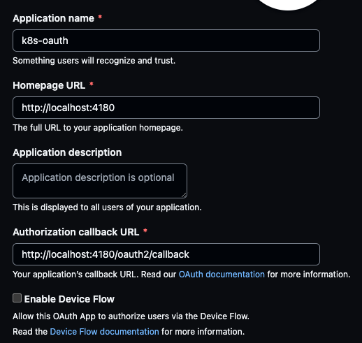

# Minimal OAuth Locally

We will use the Oauth2 Proxy to make a static site private with minimal dependencies.  In this case, I'm going to serve a [Quarto](https://quarto.org/) site (my favorite static site generator), and secure it with an email whitelist (a [text file with emails](./emails/email_list.txt)). There are many other authorization schemes in addition to an email whitelist, [which you can read about here](https://oauth2-proxy.github.io/oauth2-proxy/docs/configuration/overview).

[This section](../README.md#how-does-this-work) describes how OAuth works in the context of this example.

## Steps

### 1. Generate the static site

First, install [Quarto](https://quarto.org/), and run the following command:

```bash
quarto render
```

This will create the directory `_site/` with a static site in it (HTML, CSS, etc).

### 2. Create an OAuth App

Create an [OAuth App](https://github.com/settings/applications/new), but fill out the fields like this for local testing:

> 

Make sure you store the `Client ID` and `Client Secret` into the enviornment variables `OAUTH2_PROXY_CLIENT_ID` and `OAUTH2_PROXY_COOKIE_SECRET`, respectively.

### 3. Start The Proxy + WebServer Locally

First, add your email address to [emails/email_list.txt](./emails/email_list.txt) to whitelist yourself.  The OAuth2 proxy uses this list to determine who is authorized to see your site.  There are many other authorization schemes in addition to an email whitelist, [which you can read about here](https://oauth2-proxy.github.io/oauth2-proxy/docs/configuration/overview).

Next, generate a cookie secret by running `python -c 'import os,base64; print(base64.urlsafe_b64encode(os.urandom(32)).decode())'` and store that value in the `OAUTH2_PROXY_COOKIE_SECRET` environment variable.

Next, run the following command from this directory:

```bash
docker run -v $(PWD)/_site:/app \               # the directory with the static site
           -v $(PWD)/emails:/site_config \      # the dirctory with the email list
           -p 4180:4180 -p 4443:4443 \          # bind the ports
           quay.io/oauth2-proxy/oauth2-proxy \  # the official docker image for Oauth2 proxy
           --provider github \                  # use GitHub as the Oauth provider
           --upstream file:///app/#/ \          # The location of the static site files
           --http-address=:4180 \               # Bind the 4180 port on all interfaces which is necessary for Docker (we aren't using https for local testing).
           --authenticated-emails-file /site_config/email_list.txt \  # This is the email whitelist
           --scope user:email \                 # This tells the Oauth provider, GitHub, to share your email with the Oauth proxy
           --cookie-expire 0h0m30s \            # Optional: This helps the cookie expire more quickly which could be helpful for security
           --session-cookie-minimal true \      # Optional: don't store uncessary info in cookie since we aren't using features that require it
           --skip-provider-button true \        # Don't need a seperate "login with GitHub" screen
           --cookie-secret $OAUTH2_PROXY_COOKIE_SECRET \  # This is the secret you generate, see https://oauth2-proxy.github.io/oauth2-proxy/docs/configuration/overview
           --client-id $OAUTH2_PROXY_CLIENT_ID \          # This is the ID of your Oauth App from GitHub
           --client-secret $OAUTH2_PROXY_CLIENT_SECRET \  # This is the secret of your Oauth App from GitHub
           --cookie-csrf-per-request=true \                          # allows for parallel requests
           # THE BELOW FLAGS ARE ONLY FOR LOCAL TESTING \
           --redirect-url="http://localhost:4180/oauth2/callback" \  # this is necessary for local testing only
           --cookie-secure=false \                                   # this is necessary for local testing only
           --cookie-csrf-expire=5m                                   # this is necessary for local testing only
```

Note how the OAuth2 Proxy doubles as a web server also!  That is what `--upstream` flag enables. 

_For performance purposes, you may want to put the proxy behind another webserver like [Caddy](https://caddyserver.com/) or [Nginx](https://www.nginx.com/), but it's not required._

### 4. Test Security / Access

There is a file named [emails/email_list.txt](./emails/email_list.txt) that contains a list of the email identities that are allowed to view your site.  Try misspelling your email on purpose and see what happens when you do a hard refresh after a few seconds.  Try changing it back.


# Next Lesson: Deploy It!

Now that you have a minimal idea of how this works locally, you can proceed to host your static site on a VM or other hosted solution.  

**:point_right: [See Lesson 2: Serving Your Site](../simple/README.md). :point_left:**

In that lesson, we will show you how to:

- Use a hosting provider to deploy your secure static site.
    - You will learn about a few alternatives (one of them for free).
- Enable `https` and setup a custom domain.

# Is this only for static sites?

No! You can put applications behind the proxy, like a dashboard.  Instead of passing `file://...` to the `--upstream` flag, you pass a URL, like `http://your.internal.app`.  You can see an [example of this on Kuberenetes here](https://github.com/hamelsmu/k8s-oauth/blob/main/gke_k8s/k8s/deployment_2.yml#L89) and you can read more about this in [the docs on configuring the upstream](https://oauth2-proxy.github.io/oauth2-proxy/docs/configuration/overview#upstreams-configuration).
