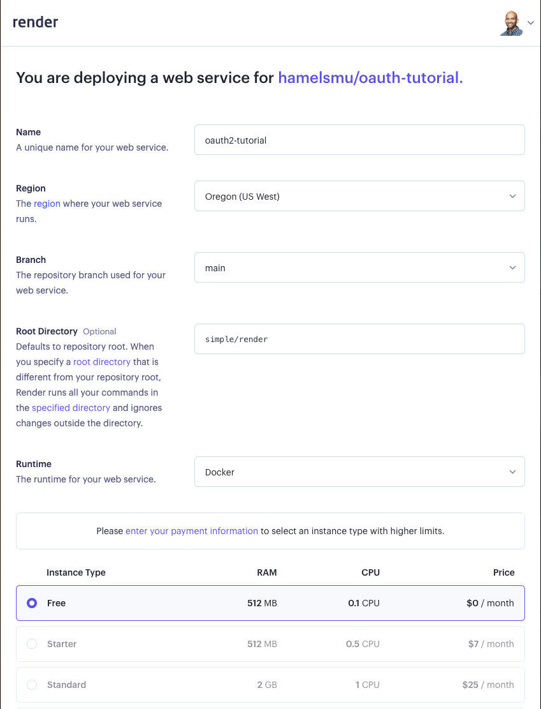

# Serving Your Site

## Render

[Render](https://render.com/) is a hosting provider that has a free tier that will work for our purposes.  We just have to learn a little bit about their YAML, but if you did the [first tutorial](../local/README.md), it will be approachable.

Render also has [Oauth2 Proxy tutorial](https://render.com/blog/password-protect-with-oauth2-proxy) which is pretty close to what we want.

### Setup

First, [fork this repo](https://github.com/hamelsmu/oauth-tutorial/fork).

Then click on [this link to start a Web Service](https://dashboard.render.com/select-repo?type=web), and grant Render access to the repo you just forked.  In the next screen, select the free tier and select these options:

