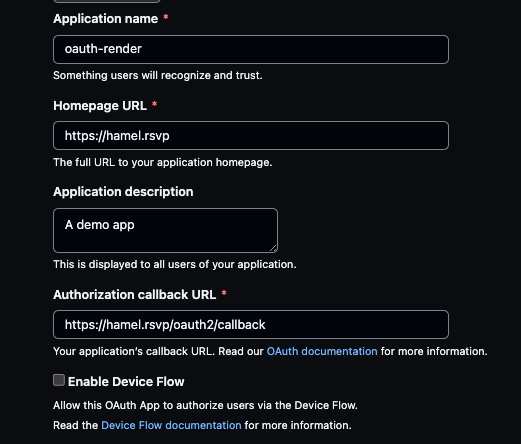
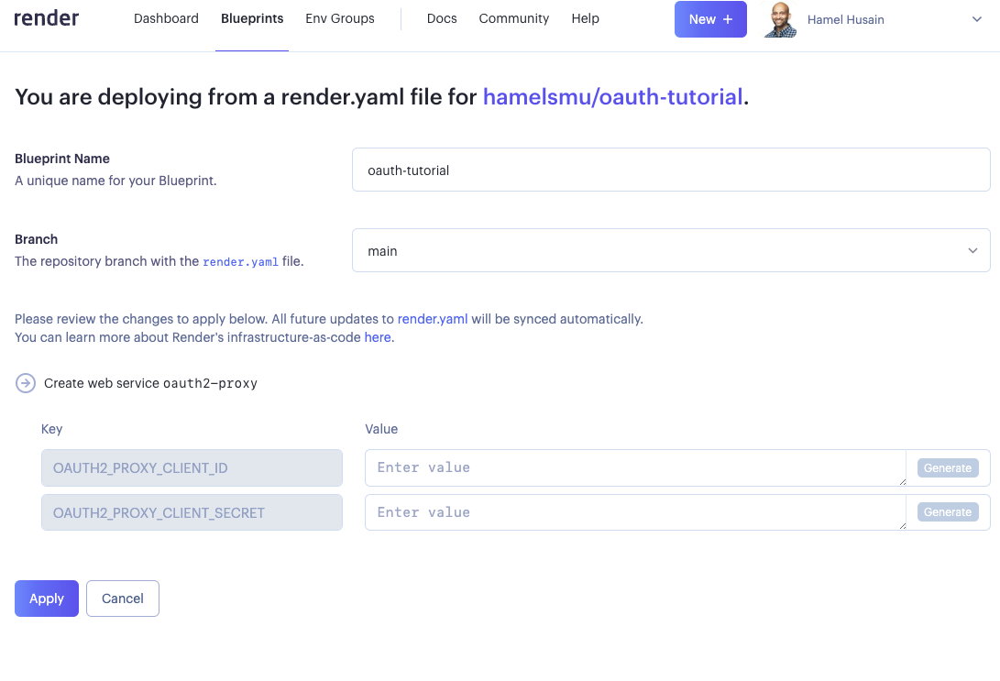

# Serving Your Site

## Render

[Render](https://render.com/) is a hosting provider that has a free tier that will work for our purposes.  We just have to learn a little bit about their YAML, but if you did the [first tutorial](../local/README.md), it will be approachable.

Render also has [Oauth2 Proxy tutorial](https://render.com/blog/password-protect-with-oauth2-proxy) which is pretty close to what we want.

### Setup

1. This will be more fun if you have a custom domain.  If you don't have one you can [buy one here](https://domains.google.com). In this example, I'm using the custom domain `hamel.rsvp`.

1. Create another OAuth application and save the `Client ID` and `Client Secret` as you did in the [minimal example](../local/README.md).  You can fill it out like this:

2. [fork this repo](https://github.com/hamelsmu/oauth-tutorial/fork).

3. Optional: Navigate to the [simple/render/](./render/) folder in this repo and run `quarto render` to generate the content of the static site into the `_site/` folder.

4. Finally, [click this link to deploy the app](https://dashboard.render.com/blueprints), and grant Render access to the repo you just forked.  Next, fill in values for the `OAUTH2_PROXY_CLIENT_ID` and `OAUTH2_PROXY_CLIENT_SECRET`:

